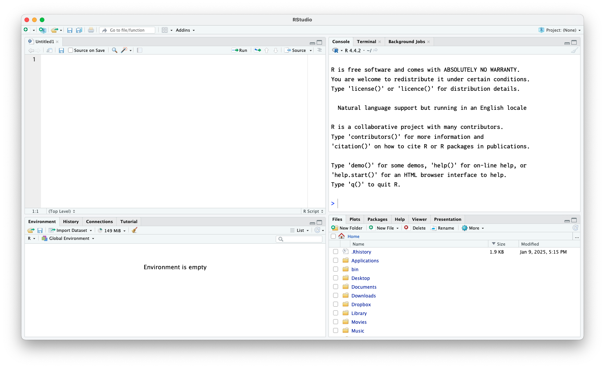

## 自己紹介

:::: {.columns}
::: {.column width="60%"}

+ 小杉考司（こすぎこうじ）
+ 専修大学人間科学部　教授　博士（社会学）
+ 担当講義；心理学データ解析基礎，心理学データ解析応用
+ 専門分野
    + 心理尺度の作り方，使い方
    + 多変量解析（因子分析，多次元尺度構成法），統計モデリング
    + 統計パッケージ開発；exametrika
+ 関わった書籍
    + [数値シミュレーションで読み解く統計のしくみ〜Rでためしてわかる心理統計](https://amzn.to/3XlA5Gq)
    + [研究論文を読み解くための多変量解析入門 基礎篇: 重回帰分析からメタ分析まで](https://amzn.to/3EWhLNY)
    + [言葉と数式で理解する多変量解析入門](https://amzn.to/4gYB32u)
など
:::

::: {.column width="40%"}

:::
::::


## Rの紹介
:::: {.columns}
::: {.column width="60%"}
- **R言語**はオープンソースの統計解析環境
  - 豊富な統計手法とグラフィックス機能
  - 無料で利用可能で継続的に発展中
  - 拡張パッケージが充実（CRAN, Bioconductor等）
  - データサイエンス・統計分析の標準ツールの一つ

- **RStudio**はRをより使いやすくする統合開発環境（IDE）
  - コード編集、実行、可視化が一画面で完結
  - プロジェクト管理機能で作業を整理
  - Rmarkdown/Quartoによる再現可能な分析レポート作成
:::

::: {.column width="40%"}

:::
::::


## Rのはじめかた

~~0. SPSSやSASなどの統計ソフトをアンインストールします~~

1. `CRAN`（しーらん）と検索します。``The Comprehensive R Archive Network``というサイトが出てくるはずです。
2. 自分のOS/CPUに合ったページから，最新版をダウンロードします。現在はR4.4.2になります。
3. 指示に従ってインストール！「次へ」を連打するだけでいいです。簡単ですね！


### RStudioも使いましょう

1. `RStudio`で検索します。``RStudio Desktop``あるいはPosit社が出てきます。
2. `Install RStudio`からRStudio Desktopをダウンロードしてインストールしましょう。

<i class="far fa-lightbulb"></i> RStudioはServer版もあります。サーバを用意すればブラウザ経由で簡単に使える利点があります。


### RStudioの起動画面



+ 大きく4分割して使います。
+ 起動して最初にやるのが「**環境設定**」です。
+ メニューバーから，Tools > Global Optionsと進みます。


### オススメ設定


+ General > Basic のWrokspace，`Save Workspace to .RData on exit:`を**never**に
+ General > Graphics > Graphics Deviceの`Backend`を**AGG**に
+ Appearance の `Editor Font`を見やすいフォントにしましょう
+ Appearance の `Editor Font size`を見やすい大きさにしましょう


<i class="far fa-lightbulb"></i>おすすめフォント

+ [Bizin Gothic](https://github.com/yuru7/bizin-gothic)
+ [HackGen](https://github.com/yuru7/HackGen)

### オススメ設定(つづき)


+ Pane Layoutを
  + **Source**と**Cosole**を横並びに
  + かなりワイドな画面をお使いの方は，`Add Column`で3列にしてsource paneを一列増やそう

+ 設定が終わったら **Apply(適用)** ボタンをおして，**OK** で閉じる


### RStudioの4つの窓


+ `Source`ペインはエディタ領域で，Rスクリプトを書く場所。
+ `Console`ペインはRエンジン。直接Rコードを書いてもいいし，`Source`から一行ずつ，あるいは`Source`全体を流し込んで計算を実行する。


### RStudioの4つの窓


+ `Environment`はメモリに入っている変数・オブジェクトを表示
+ `Files`はワーキングディレクトリの表示，簡単な操作
+ `Package`はパッケージ管理(後述)
+ `Plots`,`Viewer`は出力表示


### Rはプロジェクト管理が基本

+ プロジェクト＝フォルダに紐づいた作業環境を作ろう
  + File > New ProjectからNew Directory/Existing Directory/Version Controlを選ぶ
    + New Directory; 新しいフォルダで作業開始
    + Existing Directory; 既存のフォルダをプロジェクトと紐付け
    + Version Control; Githubレポジトリとプロジェクトを紐付け

<i class="fas fa-heart"></i> プロジェクトにしておくと，作業フォルダの設定も自動でなされるから，ファイルの読み込みなどでパスの指定が楽になります。

+ 今回の春セミ用にプロジェクトフォルダを作りましょう！
    + すでにフォルダに色々まとめている人は，Existing Directoryから
    + まだフォルダがない人は，New Directoryから


## Rをさわってみましょう

### はじめの1歩


+ Rはインタプリタ言語＝一問一答
  + Consoleに`>`が出ていたら聞く準備ができています。
  + Consoleに`+`が出ていたら前の入力が終わってません。

+ 直接Consoleに書き込むのではなく，スクリプトに書きましょう。
  + File > New File > R Script と進むと無名のスクリプトファイルが開きます
+ スクリプトファイルが開いたら，まず次のように書きます。


::: {.cell}

```{.r .cell-code}
rm(list = ls())
```
:::


+ 一行目は呪文のようなものだと思ってください。
    + `rm`という関数はremoveを意味していて，現在Rのメモリにある変数やオブジェクトを除外します。
    + `list=ls()`は「メモリのすべてのオブジェクトリスト」を意味するので，これで環境の初期化になります。

### パッケージ


+ パッケージは関数のセット。元のRに追加するだけで機能が増えます。
+ パッケージはCRANを通じて公開され，ペインの`Packages`タブで管理できます。


+ デフォルトではCRANから取ってくることになります。(要ネット環境)
    + Packagesのところで`exametrika`と入力してインストールしちゃいましょう。
    + あるパッケージが他のパッケージを必要とすることもあります。これを**依存パッケージ**といいます。
    + RStudioのPackagesタブでは`install dependencies`にチェックがあるのがデフォルトです。
        + 依存パッケージがあれば自動的にインストールされます。
        + `exametrika`は`igraph`などに依存していますので，それらが同時に導入されます


### パッケージの使い方

+ パッケージを使うには`library`と書きます。


::: {.cell}

```{.r .cell-code}
library(exametrika)
```

::: {.cell-output .cell-output-stderr}

```
Loading required package: mvtnorm
```


:::

::: {.cell-output .cell-output-stderr}

```
Loading required package: igraph
```


:::

::: {.cell-output .cell-output-stderr}

```

Attaching package: 'igraph'
```


:::

::: {.cell-output .cell-output-stderr}

```
The following objects are masked from 'package:stats':

    decompose, spectrum
```


:::

::: {.cell-output .cell-output-stderr}

```
The following object is masked from 'package:base':

    union
```


:::
:::


+ これで`exametrika`パッケージの持つ関数が実行できるようになりました！他のパッケージも同様です。

+ パッケージのインストールを毎回する必要はありません。インストールは「手に入れる」ということだからです。
+ パッケージの実装(`library`)はセッション毎に行う必要があります。これは「そうびする」ようなものです。
+ Rスクリプトの冒頭で`rm(list=ls())`としましたが，分析に必要なパッケージはスクリプトの最上部にまとめて書いておきましょう。
    + Rはインタプリタなので，逐次的に処理が進みますが，行ったり来たりしていると「パッケージを読み込んだっけ？」とか「今は何の数字で何の計算をしてるんだっけ？」となってしまいます。
    + 細かいことですが，パッケージは読み込む順番に影響されることがあります。
        + 同じ関数名を異なるパッケージが使っている場合，後で読み込まれた方が上書きされます。
        + 混同しないように`PackageName::function`のように`::`で明示することがあります。
        

### 数値計算の基礎

+ スクリプトに四則演算を書いて，Cmd+Enterでコンソールに送ります。
+ 複数行選択/Runボタン/Sourceボタンをつかってもいいでしょう。


::: {.cell}

```{.r .cell-code}
1 + 2
```

::: {.cell-output .cell-output-stdout}

```
[1] 3
```


:::

```{.r .cell-code}
3 - 4
```

::: {.cell-output .cell-output-stdout}

```
[1] -1
```


:::

```{.r .cell-code}
5 * 6
```

::: {.cell-output .cell-output-stdout}

```
[1] 30
```


:::

```{.r .cell-code}
7 / 3
```

::: {.cell-output .cell-output-stdout}

```
[1] 2.333333
```


:::
:::


+ 出力に`[1]`とあるのは気にしないでください。
    + Rはベクトルで処理します。今回の演算も，要素が1つのベクトルとして考えて処理しています。

### 数値計算の基礎

+ 計算結果を保持する，あるいは名前をつけて管理することができます。
+ Rは「名前をつけて管理する対象」をすべて**オブジェクト**といいます。


::: {.cell}

```{.r .cell-code}
a <- 1 + 2
b <- 3 - 4
print(a)
```

::: {.cell-output .cell-output-stdout}

```
[1] 3
```


:::

```{.r .cell-code}
print(b)
```

::: {.cell-output .cell-output-stdout}

```
[1] -1
```


:::

```{.r .cell-code}
print(a + b)
```

::: {.cell-output .cell-output-stdout}

```
[1] 2
```


:::
:::


+ `<-`で代入を意味します。ショートカット(ALTと-,optionと-)も覚えておこう
+ RStudioの`Environment`タブに保存されているオブジェクトが表示されています。ダブルクリックで確認できます。


::: {.cell}

```{.r .cell-code}
a <- 5
a + b
```

::: {.cell-output .cell-output-stdout}

```
[1] 4
```


:::
:::


<i class="far fa-lightbulb"></i>同じオブジェクト名なら上書きされることに注意

### ベクトル，行列，リスト，データフレーム

+ 複数の数字のセット，**ベクトル**は`c()`でくくることで表現します。
    + 連続した数字はコロン`:`で表現します。
+ 2次元に並ぶ数字のセット，**行列**は`matrix()`でつくります。
    + `matrix`関数にベクトルを与えるなどします。
+ 3次元以上の数字のセット，**配列**は`array()`で，`dim`オプションで各次元の大きさを指定します。
+ 数字，文字，論理値(T/F)などが混在するもののセット，**リスト**は`list()`でつくります。
+ リストの中でも矩形に整っている**データフレーム**は，`data.frame()`でつくります。

<i class="fas fa-check"></i> 分析するときはデータフレームがもっともよく使われます

<i class="fas fa-check"></i> データフレームの上位互換，`tibble`という型もあります。これは`tibble`パッケージを読み込むことで使えるようになります。


### ベクトル（Vector）の例

#### 数値ベクトル


::: {.cell}

```{.r .cell-code}
x <- c(1, 2, 3, 4, 5)
print(x)
```

::: {.cell-output .cell-output-stdout}

```
[1] 1 2 3 4 5
```


:::
:::


#### 文字列ベクトル


::: {.cell}

```{.r .cell-code}
y <- c("りんご", "みかん", "バナナ")
print(y)
```

::: {.cell-output .cell-output-stdout}

```
[1] "りんご" "みかん" "バナナ"
```


:::
:::


#### 論理値ベクトル

+ Rには文字，数字以外に論理値というのがあります。真/TRUEか偽/FALSEか，を表します。
+ 使い方としては，論理判断の条件で使ったり，オプションの「スイッチオン・オフ」を表す時につかいます。
+ 大文字の`T`や`F`は論理値を表す特別な用語(予約語)です。


::: {.cell}

```{.r .cell-code}
z <- c(TRUE, FALSE, TRUE)
print(z)
```

::: {.cell-output .cell-output-stdout}

```
[1]  TRUE FALSE  TRUE
```


:::
:::


### 行列（Matrix）

+ 1から9までの数字で3×3行列を作成


::: {.cell}

```{.r .cell-code}
m1 <- matrix(1:9, nrow = 3, ncol = 3)
print(m1)
```

::: {.cell-output .cell-output-stdout}

```
     [,1] [,2] [,3]
[1,]    1    4    7
[2,]    2    5    8
[3,]    3    6    9
```


:::
:::


+ 行名と列名を付ける


::: {.cell}

```{.r .cell-code}
m2 <- matrix(1:9,
    nrow = 3, ncol = 3,
    dimnames = list(
        c("A", "B", "C"),
        c("X", "Y", "Z")
    )
)
print(m2)
```

::: {.cell-output .cell-output-stdout}

```
  X Y Z
A 1 4 7
B 2 5 8
C 3 6 9
```


:::
:::


### 配列（Array）

+ 2×3×2の3次元配列を作成


::: {.cell}

```{.r .cell-code}
arr <- array(1:12, dim = c(2, 3, 2))
print(arr)
```

::: {.cell-output .cell-output-stdout}

```
, , 1

     [,1] [,2] [,3]
[1,]    1    3    5
[2,]    2    4    6

, , 2

     [,1] [,2] [,3]
[1,]    7    9   11
[2,]    8   10   12
```


:::
:::


### リスト（List）

+ 様々な型のデータを含むリストを作成


::: {.cell}

```{.r .cell-code}
my_list <- list(
    numbers = c(1, 2, 3),
    text = "Hello",
    logical = TRUE,
    matrix = matrix(1:4, 2, 2)
)
print(my_list)
```

::: {.cell-output .cell-output-stdout}

```
$numbers
[1] 1 2 3

$text
[1] "Hello"

$logical
[1] TRUE

$matrix
     [,1] [,2]
[1,]    1    3
[2,]    2    4
```


:::
:::


### リスト（List）

+ リストの要素へのアクセス
    + 名前付きリストなら`$`マークで呼び出せます


::: {.cell}

```{.r .cell-code}
my_list$numbers
```

::: {.cell-output .cell-output-stdout}

```
[1] 1 2 3
```


:::

```{.r .cell-code}
my_list$numbers[3]
```

::: {.cell-output .cell-output-stdout}

```
[1] 3
```


:::

```{.r .cell-code}
my_list$matrix[, 2]
```

::: {.cell-output .cell-output-stdout}

```
[1] 3 4
```


:::

```{.r .cell-code}
my_list$matrix
```

::: {.cell-output .cell-output-stdout}

```
     [,1] [,2]
[1,]    1    3
[2,]    2    4
```


:::
:::


### データフレーム（Data Frame）

+ データフレームの作成例
    + データフレームはリストの特殊な型なので，リストを`as.data.frame`関数で変換してもOK


::: {.cell}

```{.r .cell-code}
df <- data.frame(
    name = c("田中", "鈴木", "佐藤"),
    age = c(25, 30, 28),
    gender = c("M", "F", "M"),
    height = c(170, 160, 175)
)

print(df)
```

::: {.cell-output .cell-output-stdout}

```
  name age gender height
1 田中  25      M    170
2 鈴木  30      F    160
3 佐藤  28      M    175
```


:::
:::


+ 要素へのアクセスの仕方はリストと同じです


::: {.cell}

```{.r .cell-code}
df$age
```

::: {.cell-output .cell-output-stdout}

```
[1] 25 30 28
```


:::
:::


### データ構造の比較

| 特徴 | ベクトル | 行列 | 配列 | リスト | df | Tibble |
|------|----------|------|------|--------|----|----|
| 次元 | 1次元 | 2次元 | n次元 | 階層構造 | 2次元 | 2次元 |
| 型の統一 | 必要 | 必要 | 必要 | 不要 | 列ごと | 列ごと |
| データ型 | 単一 | 単一 | 単一 | 複数可 | 複数可 | 複数可 |
| 主な用途 | 単純な数列 | 数値計算 | 多次元データ | 複雑なデータ | データ分析 | データ分析 |


<i class="far fa-lightbulb"></i>tibble型はデータフレームの上位互換で，`tibble`パッケージを使うことで導入できます。主な特徴は次のとおりです。

+ 型情報の表示
+ 行数と列数の表示
+ データの一部のみ表示（大きなデータセット時に便利）

### パイプ演算子を活用しよう

- パイプ演算子は、データの処理を順番に繋げてくれる記号
- 左から右へ、データが流れていくイメージ！コードが読みやすく、理解しやすくなる

#### 基本的な使い方

+ パイプ演算子を使わないでいると？


::: {.cell}

```{.r .cell-code}
result <- sum(sqrt(abs(log(c(1:10)))))
```
:::


+ パイプ演算子を使ってみると？


::: {.cell}

```{.r .cell-code}
result <- c(1:10) |>
    log() |>
    abs() |>
    sqrt() |>
    sum()
```
:::


+ パイプ演算子はショートカット`Ctrl/Cmd + Shift + M`で入力できます
    + `|>`はR4.1以降使えるようになった，Rのもってるパイプ演算子
    + `%>%`は`magrittr`パッケージや，それを含んだ`tidyverse`パッケージで以前から使われていたもの

### (余談)tidyな世界

+ `tidyverse`パッケージは，データハンドリングを画期的に簡単にしたパッケージで，これでRのユーザが一気に広がったと言っても過言ではありません。
+ `tidyverse`パッケージはパッケージのパッケージ。
    + 大規模データ用のデータフレーム，`tibble`
    + パイプ演算子のパッケージ`magrittr`
    + 描画を綺麗にしてくれるパッケージ`ggplot2`などが含まれます


+ 専門の書籍も出ています <i class="fa-solid fa-book"></i>`tidyverse`パッケージを基本にした[改訂2版RユーザのためのRStudio[実践]入門〜tidyverseによるモダンな分析フローの世界](https://amzn.to/4bisTkc)


### (余談)チートシートを活用しよう

+ RStudioのメニューバー，Help> Cheat Sheetsと進んでください
+ PDFファイル1，2枚分で基本的な使い方を始めとした，様々なチートシートが現れます！


## 具体的にデータを扱ってみよう

### データの読み込みと操作

#### CSVファイルの読み込み

+ CSVファイルはRでもっとも一般的なデータ形式の一つです
+ エクセルファイルなどと違って，アプリケーションに依存せず，メモ帳で開くこともできますので，あらゆるOSに対応できます。
+ 基本的な読み込み方法は `read.csv()` 関数を使います
+ `tidyverse`パッケージを使っている人は，`read_csv()`関数のほうが細かな調整が効いていいかも

### 基本的なCSV読み込み


::: {.cell}

```{.r .cell-code}
data <- read.csv("data.csv")
```
:::


#### 日本語を含むCSVファイルの場合

+ Windowsユーザ/Excelユーザは文字化けを起こす可能性があります。
+ 世界標準である`UTF-8`という文字コードでファイルを管理しましょう


::: {.cell}

```{.r .cell-code}
data <- read.csv("data.csv", fileEncoding = "UTF-8")
```
:::


+ Rstudioの`Files` タブからファイルを選んで`Import Dataset`とするとGUIでも操作できます。
    + Excelファイルを読み込みたい場合は，そちらを使うのもいいでしょう


### Import Dataset


### サンプルコードを読み込んでみよう

+ インターネットから読み込むこともできます！
+ 次のコードでサンプルデータを読み込んでみましょう。


::: {.cell}

```{.r .cell-code}
baseball <- read.csv("https://shorturl.at/X4ctc")
```
:::


+ ショートURLの参照先は怪しいところではありません。
    + https://kosugitti.github.io/psychometrics_syllabus/codes/SampleData/BaseballDecade.csv
    + 私の[心理統計教育教材](https://kosugitti.github.io/psychometrics_syllabus/)サイトに置いてあるサンプルデータです
    + 野球選手の基本情報など，10年分のデータがあります。

+ データの一部(冒頭)を`head`関数で確認してみましょう


::: {.cell}

```{.r .cell-code}
head(baseball)
```

::: {.cell-output .cell-output-stdout}

```
      Year       Name team salary bloodType height weight UniformNum position
1 2011年度 永川　勝浩 Carp  12000       O型    188     97         20     投手
2 2011年度 前田　健太 Carp  12000       A型    182     73         18     投手
3 2011年度 栗原　健太 Carp  12000       O型    183     95          5   内野手
4 2011年度 東出　輝裕 Carp  10000       A型    171     73          2   内野手
5 2011年度   シュルツ Carp   9000      不明    201    100         70     投手
6 2011年度   大竹　寛 Carp   8000       B型    183     90         17     投手
  Games AtBats Hit HR Win Lose Save Hold
1    19     NA  NA NA   1    2    0    0
2    31     NA  NA NA  10   12    0    0
3   144    536 157 17  NA   NA   NA   NA
4   137    543 151  0  NA   NA   NA   NA
5    19     NA  NA NA   0    0    0    9
6     6     NA  NA NA   1    1    0    0
```


:::
:::


### オブジェクトの基本情報

+ `str`関数，あるいは`Environment`タブにあるオブジェクト名を開くと，基本情報が確認できます。


::: {.cell}

```{.r .cell-code}
str(baseball)
```

::: {.cell-output .cell-output-stdout}

```
'data.frame':	6546 obs. of  17 variables:
 $ Year      : chr  "2011年度" "2011年度" "2011年度" "2011年度" ...
 $ Name      : chr  "永川　勝浩" "前田　健太" "栗原　健太" "東出　輝裕" ...
 $ team      : chr  "Carp" "Carp" "Carp" "Carp" ...
 $ salary    : int  12000 12000 12000 10000 9000 8000 8000 7500 7000 6600 ...
 $ bloodType : chr  "O型" "A型" "O型" "A型" ...
 $ height    : int  188 182 183 171 201 183 177 173 176 188 ...
 $ weight    : int  97 73 95 73 100 90 82 73 80 97 ...
 $ UniformNum: int  20 18 5 2 70 17 31 6 1 43 ...
 $ position  : chr  "投手" "投手" "内野手" "内野手" ...
 $ Games     : int  19 31 144 137 19 6 110 52 52 40 ...
 $ AtBats    : int  NA NA 536 543 NA NA 299 192 44 149 ...
 $ Hit       : int  NA NA 157 151 NA NA 60 41 11 35 ...
 $ HR        : int  NA NA 17 0 NA NA 4 2 0 1 ...
 $ Win       : int  1 10 NA NA 0 1 NA NA NA NA ...
 $ Lose      : int  2 12 NA NA 0 1 NA NA NA NA ...
 $ Save      : int  0 0 NA NA 0 0 NA NA NA NA ...
 $ Hold      : int  0 0 NA NA 9 0 NA NA NA NA ...
```


:::
:::


+ 何年度のデータか(`Year`)，選手名(`Name`)，どのチーム所属か(`team`)，年俸(`salary`)などがあります。
+ データの型もわかります
    + `chr`は文字列型です。四則演算の対象ではありません。
    + `int`,`num`は数字です(整数と実数)
    + `NA`は欠損値を表しています。

+ `read.csv`関数は読み込んだデータを自動的にデータフレーム型にします。

### 記述統計量

+ `summary`関数で要約統計量を算出できます


::: {.cell}

```{.r .cell-code}
summary(baseball)
```

::: {.cell-output .cell-output-stdout}

```
     Year               Name               team               salary     
 Length:6546        Length:6546        Length:6546        Min.   :  200  
 Class :character   Class :character   Class :character   1st Qu.: 1000  
 Mode  :character   Mode  :character   Mode  :character   Median : 2000  
                                                          Mean   : 5178  
                                                          3rd Qu.: 5700  
                                                          Max.   :65000  
                                                                         
  bloodType             height          weight      UniformNum   
 Length:6546        Min.   :163.0   Min.   : 60   Min.   : 0.00  
 Class :character   1st Qu.:177.0   1st Qu.: 78   1st Qu.:16.00  
 Mode  :character   Median :180.0   Median : 83   Median :33.00  
                    Mean   :180.7   Mean   : 84   Mean   :34.93  
                    3rd Qu.:184.0   3rd Qu.: 89   3rd Qu.:52.00  
                    Max.   :216.0   Max.   :135   Max.   :99.00  
                                                                 
   position             Games            AtBats           Hit        
 Length:6546        Min.   :  1.00   Min.   :  0.0   Min.   :  0.00  
 Class :character   1st Qu.:  9.00   1st Qu.: 23.0   1st Qu.:  4.00  
 Mode  :character   Median : 25.00   Median : 95.0   Median : 21.00  
                    Mean   : 40.67   Mean   :165.1   Mean   : 42.53  
                    3rd Qu.: 61.00   3rd Qu.:271.0   3rd Qu.: 69.00  
                    Max.   :144.00   Max.   :603.0   Max.   :216.00  
                                     NA's   :3233    NA's   :3233    
       HR              Win              Lose             Save      
 Min.   : 0.000   Min.   : 0.000   Min.   : 0.000   Min.   : 0.00  
 1st Qu.: 0.000   1st Qu.: 0.000   1st Qu.: 0.000   1st Qu.: 0.00  
 Median : 1.000   Median : 1.000   Median : 1.000   Median : 0.00  
 Mean   : 3.967   Mean   : 2.517   Mean   : 2.509   Mean   : 1.27  
 3rd Qu.: 4.000   3rd Qu.: 4.000   3rd Qu.: 4.000   3rd Qu.: 0.00  
 Max.   :60.000   Max.   :24.000   Max.   :15.000   Max.   :54.00  
 NA's   :3233     NA's   :3307     NA's   :3307     NA's   :3307   
      Hold       
 Min.   : 0.000  
 1st Qu.: 0.000  
 Median : 0.000  
 Mean   : 3.511  
 3rd Qu.: 3.000  
 Max.   :45.000  
 NA's   :3307    
```


:::
:::


+ 行数，列数を確認して，データのサイズを見ておきましょう


::: {.cell}

```{.r .cell-code}
NROW(baseball)
```

::: {.cell-output .cell-output-stdout}

```
[1] 6546
```


:::

```{.r .cell-code}
NCOL(baseball)
```

::: {.cell-output .cell-output-stdout}

```
[1] 17
```


:::
:::


### 変数毎の要約統計量

+ 変数に`$`でアクセスして，要約統計量を計算してみましょう。


::: {.cell}

```{.r .cell-code}
mean(baseball$height)
```

::: {.cell-output .cell-output-stdout}

```
[1] 180.7177
```


:::

```{.r .cell-code}
sd(baseball$height)
```

::: {.cell-output .cell-output-stdout}

```
[1] 5.613504
```


:::

```{.r .cell-code}
median(baseball$weight)
```

::: {.cell-output .cell-output-stdout}

```
[1] 83
```


:::

```{.r .cell-code}
max(baseball$salary)
```

::: {.cell-output .cell-output-stdout}

```
[1] 65000
```


:::

```{.r .cell-code}
min(baseball$salary)
```

::: {.cell-output .cell-output-stdout}

```
[1] 200
```


:::

```{.r .cell-code}
quantile(baseball$salary)
```

::: {.cell-output .cell-output-stdout}

```
   0%   25%   50%   75%  100% 
  200  1000  2000  5700 65000 
```


:::
:::


### 因子型をつくってみましょう

+ チーム名はたかだか12種類です。名義尺度水準＋ラベルの数値であるFactor型にしてみましょう。


::: {.cell}

```{.r .cell-code}
baseball$team <- as.factor(baseball$team)
summary(baseball$team)
```

::: {.cell-output .cell-output-stdout}

```
    Carp     DeNA  Dragons   Eagles Fighters   Giants    Lions    Lotte 
     517      550      573      569      533      524      528      538 
    Orix Softbank Swallows   Tigers 
     579      525      556      554 
```


:::
:::


+ 一行目で，同じ変数に「上書き」していることに注意
+ `as.factor`関数は変数をFactor型に変換するものです
    + クラス名，実験の水準などグループ化変数として扱うのに便利です

### 可視化してみましょう

+ **データは図にする**のが基本です。Rの基本関数でも十分綺麗な図が描けます。
    + ヒットの数をヒストグラムにしてみましょう
    + ヒストグラムの関数は`hist`です


::: {.cell}

```{.r .cell-code}
print(head(baseball))
```

::: {.cell-output .cell-output-stdout}

```
      Year       Name team salary bloodType height weight UniformNum position
1 2011年度 永川　勝浩 Carp  12000       O型    188     97         20     投手
2 2011年度 前田　健太 Carp  12000       A型    182     73         18     投手
3 2011年度 栗原　健太 Carp  12000       O型    183     95          5   内野手
4 2011年度 東出　輝裕 Carp  10000       A型    171     73          2   内野手
5 2011年度   シュルツ Carp   9000      不明    201    100         70     投手
6 2011年度   大竹　寛 Carp   8000       B型    183     90         17     投手
  Games AtBats Hit HR Win Lose Save Hold
1    19     NA  NA NA   1    2    0    0
2    31     NA  NA NA  10   12    0    0
3   144    536 157 17  NA   NA   NA   NA
4   137    543 151  0  NA   NA   NA   NA
5    19     NA  NA NA   0    0    0    9
6     6     NA  NA NA   1    1    0    0
```


:::

```{.r .cell-code}
print(class(baseball$Hit))
```

::: {.cell-output .cell-output-stdout}

```
[1] "integer"
```


:::

```{.r .cell-code}
hist(baseball$Hit)
```

::: {.cell-output-display}
{width=672}
:::
:::


### 可視化してみましょう

+ **データは図にする**のが基本です。
    + チーム毎のヒット数の違いを見てみましょう
    + ボックスプロット(箱ひげ図)の関数は`boxplot`です
        + x軸がFactor型になっています


::: {.cell}

```{.r .cell-code}
boxplot(Hit ~ team, data = baseball)
```

::: {.cell-output-display}
{width=672}
:::
:::


### 可視化してみましょう

+ **データは図にする**のが基本です。
    + 散布図を書いてみましょう
    + 散布図は`plot`関数にx軸とy軸変数を指定します


::: {.cell}

```{.r .cell-code}
plot(baseball$height, baseball$weight)
```

::: {.cell-output-display}
{width=672}
:::
:::


### (余談)ggplotによる出力は，より綺麗です


::: {.cell}

```{.r .cell-code}
library(ggplot2)
baseball |>
    ggplot(aes(x = weight, y = height, color = team)) +
    geom_point() +
    geom_smooth(formula = "y ~ x", method = "lm", se = FALSE) +
    facet_wrap(~team)
```

::: {.cell-output-display}
{width=672}
:::
:::


## Enjoy!

+ 以上で入門コースは終了です
+ この講義では`exametrika`パッケージの他は，基本的にRの基本関数だけで分析できるようにご案内します。
+ 実は`ggexametrika`パッケージというのもあります→[こちら](https://github.com/kosugitti/ggExametrika)


## あなうんすめんと

### `exametrika` Web site

+ [exametrikaのサイトはこちら](https://kosugitti.github.io/exametrika/)

####  問題の報告

バグを発見した場合や改善の提案がある場合：

+ [GitHub Issues](https://github.com/kosugitti/exametrika/issues)にIssueを開いてください
+ 最小限の再現可能な例を提供してください
+ Rのセッション情報（sessionInfo()）を含めてください

#### ディスカッションとコミュニティ

+ [Github Discussions](https://github.com/kosugitti/exametrika/discussions)では，次のことができます。

+ 質問をする
+ 使用事例を共有する
+ 機能リクエストについて議論する
+ ヒントやコツを交換する
+ パッケージの開発に関する最新情報を得る


## Advanced Topics

### Quarto/Rmarkdown：文芸的プログラミング

#### Rmarkdownとは

+ Markdown書式というプレーンな文書作成文法 + チャンクと呼ばれるRコードの結合
+ 文書を作成(レンダリング)するときは，Rの計算を実行してその結果を文書内に反映させる

+ コピペ汚染がなく，RStudioで執筆と分析が統合，これだけで完結できます。

#### Quartoとは

+ 次世代のR Markdownです。私のスライドもQuartoで作られています
+ マルチ言語対応（R, Python, Julia等）
+ ePub, PDFなど出力も多様


### Quarto/Rmarkdown：文芸的プログラミング

#### 基本的な使い方

1. File → New FileでQuarto Document / R Markdownを選択
2. TitleやAuthorを入力，出力書式(HTML,PDF,Word)などを選ぶ画面が出ます
3. サンプル文書・コードが書いてあるファイルが生成されます

これをRneder/Knitすることでファイルが出力されます。


