```{r setup,include=FALSE}
options(htmltools.dir.version = FALSE)
library(xaringanthemer)

extra_css <- list(
  ".red" = list(color = "red"),
  ".green" = list(color = "green"),
  ".small" = list("font-size" = "60%"),
  ".med" = list("font-size" = "80%"),
  ".large" = list("font-size" = "140%"),
  ".full-width" = list(
    display = "flex",
    width   = "100%",
    flex    = "11 auto"
  )
)

style_mono_accent(
  base_color = "#006400",
  text_font_size = "25px",
  code_font_size = "15px",
  padding = "1em 1em 1em 1em", # margin
  header_h1_font_size = "45px",
  header_h2_font_size = "40px",
  header_h3_font_size = "35px",
  header_color = "#006400",
  header_font_google = google_font("Noto Sans JP"),
  text_font_google = google_font("Noto Sans JP", "400", "400i"),
  code_font_google = google_font("Noto Sans JP"),
  link_color = "chocolate"
)
```

class: center, middle

# はじめに
---
background-image: url(figures/jpaRmd_JPA2021.001.png)
background-size: cover
background-position: 90% 8%


# 文献リストの作成は大変

論文やレポートを書く時・チェックするときに大変なのが文献リスト。よくある間違いは，

+ リストにないのに引用がある，引用があるのにリストにない。
+ リストと対応する著者名，年号がない
+ リストの形式がAPA準拠じゃない

手作業でするのは大変なので，アプリケーションの手助けを借りるのが今や常識ですよね。

---

# jpaRmdも文献リストサポートがあります

+ jpaRmdはRmarkdown形式で記述しますが，内部的には数段階の変換ステップがあります。

```{r fig, echo=FALSE, fig.height=2.7, message=FALSE, warning=FALSE, dev='svglite', out.width='100%'}
knitr::include_graphics("figures/fig1.png")
```

+ ここで媒介しているTeXというのは，班組ソフトと呼ばれるものです。
+ TeXにも文献管理システムBibTeXがあり，文献管理ソフトや書誌情報提供のフォーマットとして知られています。

---

background-image: url(figures/jpaRmd_JPA2021.002.jpeg)
background-size: cover
background-position: 90% 8%

# TeXもお勧めです

+ TeXはDonald E. Knuthが自身の著書の版組の美しくなさに憤慨し、自分自身が心ゆくまで組版を制御するために開発を決意したシステム
+ 数式はもちろん，構造化された文章を書くのに向いており，何より美しい・・・ので，文系のひとも是非活用するべきです。
+ システムの導入もTeXLiveを使えば簡単です。
+ 詳しくは[LaTeX2ε美文書作成入門](https://amzn.to/2VTMm8w)をどうぞ
+ 共同編集できるTeXシステム[Overleaf](https://ja.overleaf.com/)なんかもどうぞ

---

# BibTeXはスタイルが選べます

+ BibTeXはその歴史の中でさまざまな引用スタイルを用意してきました。APAスタイルももちろんあります。

```{r fig3, echo=FALSE, fig.height=2.7, message=FALSE, warning=FALSE, dev='svglite', out.width='100%'}
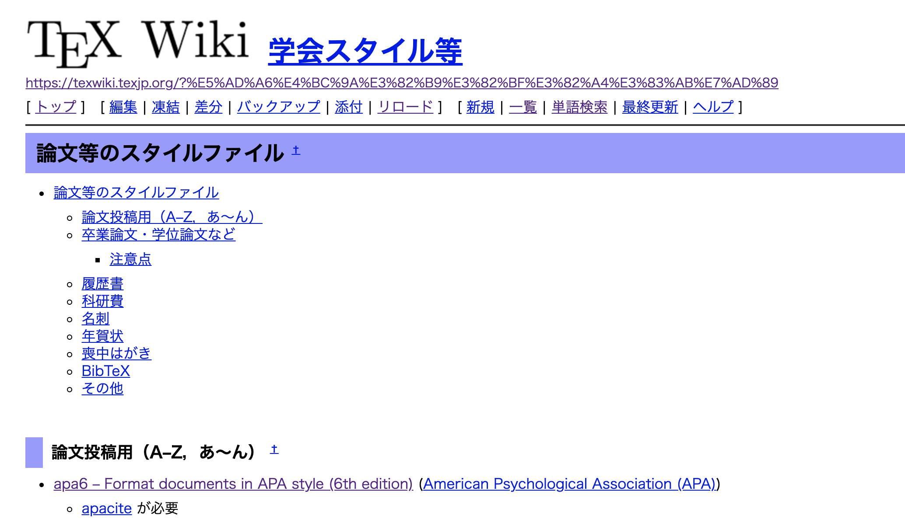
```

---

# ローカライズの問題

- とはいえ英語圏の話ですから，日本語の対応は難しい・・・

  - 引用システムについては[Citation Style Language](https://citationstyles.org/)という統一化が進んでいってます

  - MendeleyやZoteroなどはxml形式のCSLを作ることで，様々な言語やスタイルに対応しているようです

- ちなみに学会非公式ですが，BibTeXのスタイルでJPA準拠のスタイルファイルをかつて作りました。

  - 興味がある人は[こちら](https://kosugitti.github.io/jecon_jpa/)もごらんください。


---

# JPAの独自スタイル

+ 言語の問題だけではありません。JPAはAPA準拠ではありますが，日本語用のルールが追加されています。

  + 曰く「日本語文献と外国語文献を分けず，著者名（姓）のアルファベット順とし，文献番号は付けない。」
  + 曰く「著者が7名以下の場合，すべての著者を書き，最後の著者の前にカンマ（，）と＆をおく。andと綴らぬこと。」
  + 曰く「翻訳書は（原著者名），（翻訳書刊行年），（翻訳書籍名）（翻訳者名，Trans.），（翻訳書出版地：出版社）とすること」
  + and so on...

+ そこでjpaRmdです！

---

# jpaRmdは文献対応もばっちり

- YMALのところに，Rmdファイルと使うBibファイル名を書くだけで，引用・引用文献リストに対応します。

```{r YMAL, eval=FALSE, message=FALSE, warning=FALSE, include=TRUE}
title:"RMarkdownで『心理学研究』の論文は書けるのか？"
subtitle:"Can we write a paper of the Japanses Journal of psychology with RMarkdown?"
suppress - bibliography:yes
output:jpaRmd::render_jjp(Rmd_file = "paper.Rmd", Bib_file = "references.bib")
```

+ Rmdファイルと同じ場所にBibファイルを用意してやればOK！コンパイルの時に自動的に処理します。
  + 1回目の引用はフルで，2回目以降はet al.あるいは他，とつけてくれます。
  + 著者の人数に対応した引用書式の調整ももちろん。
  + 引用文献リストにJPA準拠で並べ替えてリストアップ
  + 同じ著者が同じ年に複数の論文を書いている場合，自動的にa,b,c...とつけます

---


# 使い方1 BibTeXを用意しよう

+ Bibファイルってどうすれば・・・と思うかもしれません。でも検索の時などに「Bibファイル形式」という言葉を見たことありませんか？

+ 例えばJ-stageは「メタデータをダウンロード」のところにBibTeX形式が用意されています。

```{r bibtex1, echo=FALSE, fig.height=2.7, message=FALSE, warning=FALSE, dev='svglite', out.width='90%'}
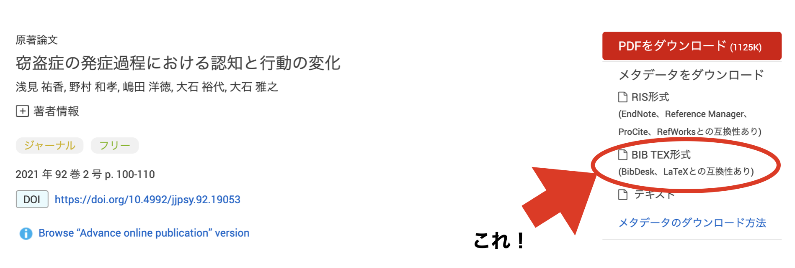
```

---

# 使い方1 BibTeXを用意しよう

+ Bibファイルってどうすれば・・・と思うかもしれません。でも検索の時などに「Bibファイル形式」という言葉を見たことありませんか？

+ 例えばGoogle Scholarはダブルクォーテーションマークをクリックすると引用形式が出てきますが，そこにBibTeX形式のファイル出力をするボタンがついています。

```{r bibtex2, echo=FALSE, fig.height=2.7, message=FALSE, warning=FALSE, dev='svglite', out.width='80%'}
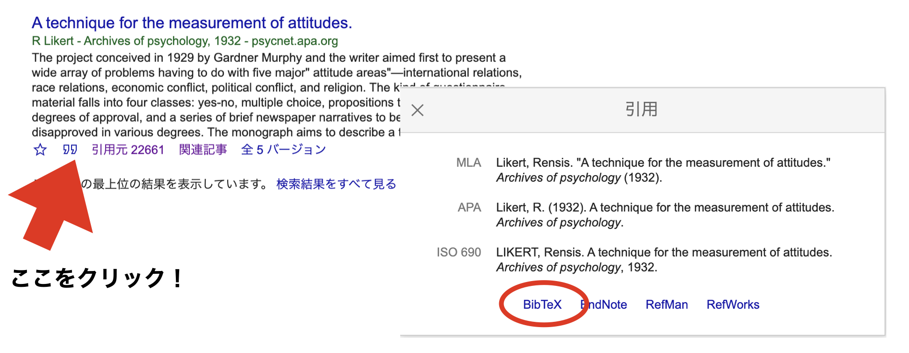
```

---

# 使い方1 BibTeXを用意しよう

+ 書籍の場合はどうしたらいいの？と思うかもしれません。

+ そんな時はこのサイト！[Lead2Amazon](https://lead.to/amazon/jp/)で出力をBibTeX形式にするとOK！

```{r bibtex3, echo=FALSE, fig.height=2.7, message=FALSE, warning=FALSE, dev='svglite', out.width='70%'}

```


---

# Bibファイルを見てみよう

+ Bibファイルはシンプルなテキストファイルです。メモ帳，エディタで開くことができます。
+ bib ファイルの各アイテムは{}で囲むものが一般的ですが，""で囲っていても問題ありません。
+ 各アイテムは大文字と小文字が混在していても構いません。AuthorもAUTHORもAUthorも同じとみなされます。


```{r bibtex4, echo=FALSE, fig.height=2.7, message=FALSE, warning=FALSE, dev='svglite', out.width='100%'}
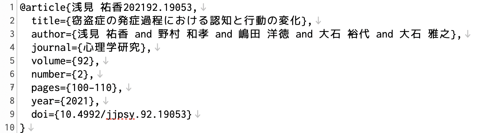
```

---

# Bibファイルの構成

+ Bibファイルの構成は，まず@マークで始まり，中括弧で括られているところまでで1セットになっています。
+ 中身（エントリ）はカンマで区切られていることを確認してください。
  + ネットから取ってきたBib形式のファイルは，そのままでは使えないものがほとんどで，加筆修正の必要があります。
  + その際，「カッコで括る」「カンマで区切る」というファイル形式を損ねると，jpaRmdが動かなくなりますので，この基本をしっかり踏まえておいください。
  <!-- + Mendeley/Zoteroなどの文献管理ソフトが出力するBibファイルもjpaRmd用に加工する必要がある場合がほとんどです。 -->

```{r bibtexp1, echo=FALSE, fig.height=2.7, message=FALSE, warning=FALSE, dev='svglite', out.width='60%'}
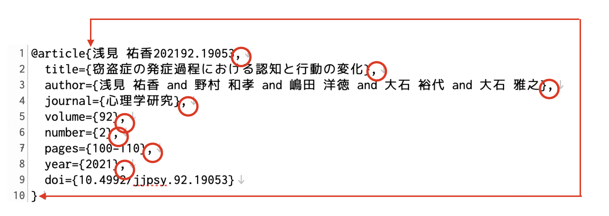
```

---

# Bibファイルの構成2

+ 1行目にある＠マークは，文献の種類(カテゴリー)を表しています。
+ jpaRmdでは**Book，Article，inCollection，InProceedings**に対応しています。それ以外のカテゴリーのものがあれば，対応しているカテゴリーに書き直してください。
    + Bookは書籍です。著者名，タイトル，出版社，出版社の所在地などの項目からなります。
    + Articleは論文です。著者名，タイトル，雑誌名，巻・号，ページ数，出版社，DOIなどの項目からなります。
    + inCollectionは本の一部を参照する時に使います。書籍の情報に加え，それが含まれている本の著者・編集者名，本のタイトル，どこの章・ページなのか，といった情報が含まれます。
    + inProceedingsは学会発表論文を参照する時に使います。

```{r bibtexp2,include=FALSE, echo=FALSE, fig.height=2.7, message=FALSE, warning=FALSE, dev='svglite', out.width='100%'}
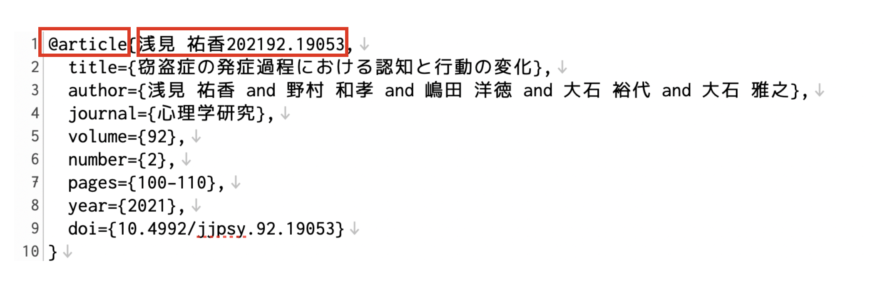
```

---

# Bibファイルの構成3

+ 1行目にある最初のレコードは，引用キーを表しています。
+ この例では，本文(Rmd)中に**＠浅見 祐香202192.19053**と書くことで引用できることになります。
  + 情報提供元が自動的に付与しているものがほとんどですが，入ってない場合は自分で入れる必要があります。
  + 引用キーは任意の文字列ですので，わかりやすいように自分で書き換えましょう(後述)。

```{r bibtexp3, echo=FALSE, fig.height=2.7, message=FALSE, warning=FALSE, dev='svglite', out.width='100%'}

```


---

# Bibファイルの構成4

+ 2行目以降が書誌情報に関する情報です。
+ 左側に変数名，右側にその値が入っており，イコールで結んでいます。この基本形式をしっかり把握しましょう。

```{r bibtexp4, echo=FALSE, fig.height=2.7, message=FALSE, warning=FALSE, dev='svglite', out.width='100%'}
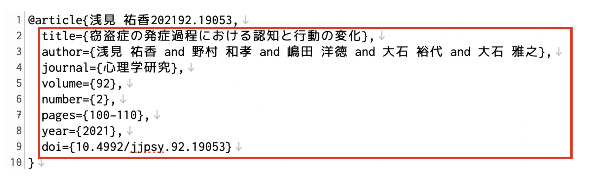
```

---

# Bibファイルを編集しよう

+ このあと，これらのファイルをjpaRmdで使えるように加工していきます。
+ ネットで取ってきたもの，Mendeley,Zoteroなどアプリが出力したものが，**必ずしも完璧で適切な形ではありません**ので，Bibファイルを加工する必要があります(といってもそれほどたくさん修正箇所があるわけではありません)。
+ 編集にもRStudioを使いましょう。RStudioは優れたエディタです。
  + Rmdファイルもそうですが，Bibファイルの文字コードはUTF-8にしてください。
  + Bibファイルだけ別エディタで編集しても構いませんが，文字コードがShift-JISだと文字化けしてうまく動きません。

---

# BibTeXを加工する1; Author

+ 加工の最初のポイントは，まず著者情報, Authorのところです。
+ **著者名は姓と名をカンマで区切ってください。**
+ **引用キーをわかりやすいものに変えましょう**
  + 自分がわかる任意の引用キーにすれば良いのですが，お勧めは半角英数文字，スペースなし，です。
   + たとえば @Asami2019 などとすれば良いでしょう。
+ 複数の著者がある場合は and で区切ってください。&マークは使わないでください。

---
# BibTeXを加工する1; Author

+ 加工例はこのようになります。

```{r , echo=FALSE, fig.height=2.7, message=FALSE, warning=FALSE, dev='svglite', out.width='100%'}
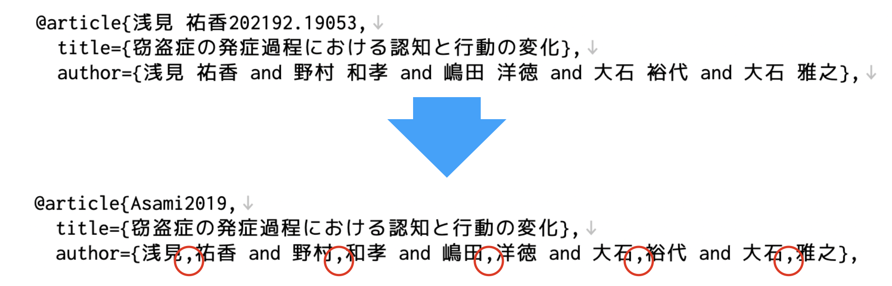
```
---

# 加工1; Author

+ 著者名の区切りは，西洋人名でも必要です。
  + Google Scholarなどで取ってきたファイルによっては，Family Name, First Nameの区切りがないものもあるので要注意。
  + 内部的には，[humaniformat](https://github.com/ironholds/humaniformat/)というRのパッケージを使って姓/名の分離を行なっています。
  + 出力に合うようにBibファイルを修正してください。

---

# 加工2; 読み仮名を与える

+ 日本の著者の場合，その読み方を**YOMI**変数を作って入力してください。機械は日本語文字の読み方まではわからないので，この情報がないと「日本語名をアルファベットに変換して並べ替える」というJPAルールに従うことができなくなります。

```{r , echo=FALSE, fig.height=2.7, message=FALSE, warning=FALSE, dev='svglite', out.width='100%'}
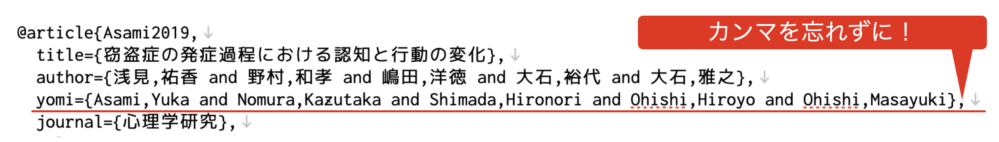
```


---

# 加工3; Editor

+ inCollection などで編集者を入力したい場合，あるいは翻訳者，日本版著者(一人の翻訳者)，訳本の監修者などがある場合があります。
+ 編集者は Editor，日本語版著者は JAuthor，日本語版監訳者は JKanyaku， 翻訳者は TRANSAUTHOR変数を作って対応します。
+ これらも人名として扱いますので，著者名同様，姓と名の 間をカンマで区切り，複数人の場合はandでつなげる，というようにしてください。

---

# 加工3; Editor

+ 加工例と出力例を示します。


```{r , echo=FALSE, fig.height=2.7, message=FALSE, warning=FALSE, dev='svglite', out.width='100%'}
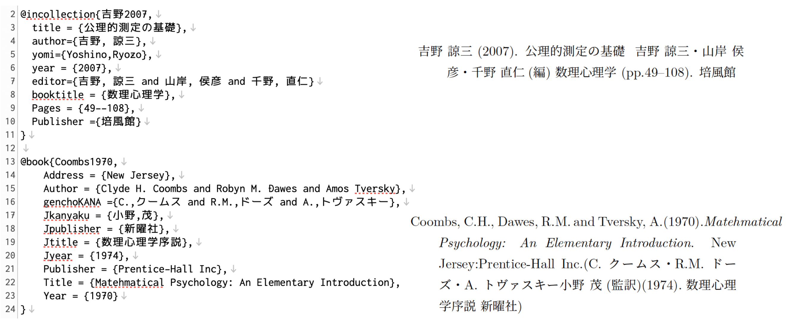
```

---

# 加工4; Tips1

+ 団体名など，「姓名」の形になっていない場合は，全体を{}で括ることで対応します。
+ 加工例と出力例を示します。

```{r , echo=FALSE, fig.height=2.7, message=FALSE, warning=FALSE, dev='svglite', out.width='100%'}
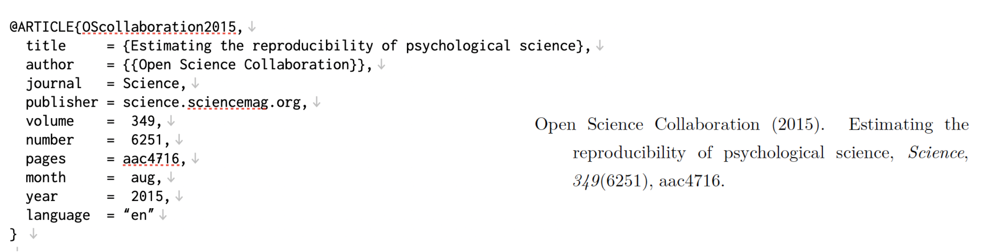
```


---

# 加工5; Tips2

+ ドイツ語やフランス語などの書籍が英語に翻訳された場合，英語への翻訳者，編集情報その他を追記します。これらの情報を入れる項目は，TRANSRATOR, TRANSWORK,TRANSINFOです。
+ 社名などで&マークが必要な場合は，\&と表記します。
+ 加工例と出力例を示します。

```{r , echo=FALSE, fig.height=2.7, message=FALSE, warning=FALSE, dev='svglite', out.width='100%'}
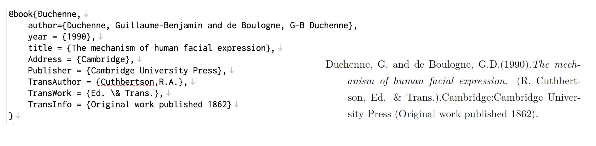
```

---

# あとは本文で書くだけ

+ その他書き方のサンプルとしては，jpaRmd::set_rc_jpa()で作られるサンプルファイルに含まれているreferences.bibを参照してください。
+ 多少，出力に合うようにbibファイルの方を合わせるという工夫が必要かもしれません。

+ 使う時は本文で，引用キーを使って引用するだけです。
  + 文中の引用は ＠引用キー で
  + 文末の引用は [@引用キー]で

+ 形式が間違っていなければ，引用文献リストも自動的に出来上がります。

---

# こんな感じに！

```{r , echo=FALSE, fig.height=2.7, message=FALSE, warning=FALSE, dev='svglite', out.width='100%'}
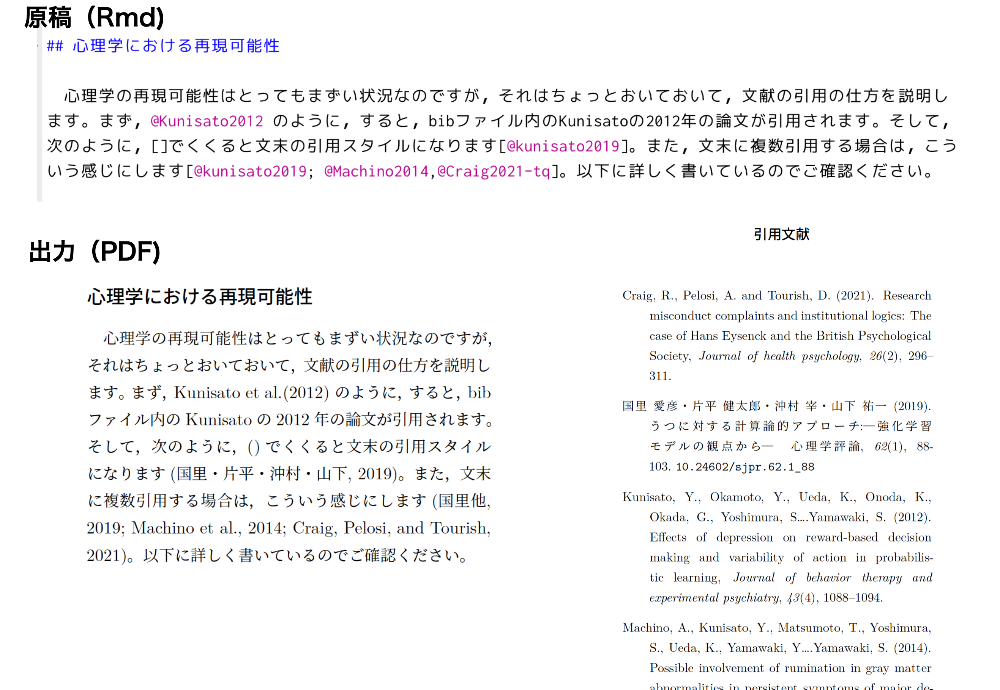
```
---

# コンパイルでエラーが出たら

+ 引用関係でエラーが出てPDFが出力されない，ということがあります。
+ エラーが出た時にチェックすべきこととして，引用キーとBibfileの記述が合っているかどうか，があります。
  + Bibfileにあっても本文で引用されないのは問題になりません(無視されるので，冗長なBibfileでOK)
  + 引用されているのにBibfileにキーがない場合はエラーが出力されます。
  
```{r , echo=FALSE, fig.height=2.7, message=FALSE, warning=FALSE, dev='svglite', out.width='100%'}
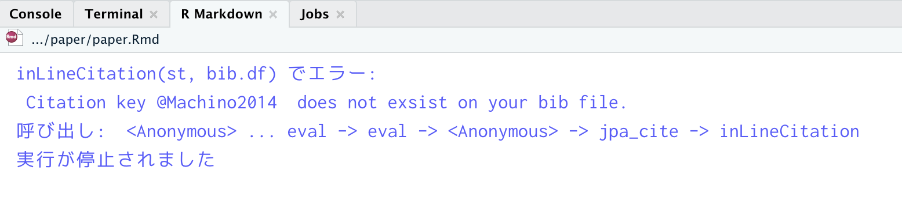
```


---

# よくあるエラー

+ **本文の引用キーの後ろには，半角スペースを入れておいてください。**
+ コンパイル時は@の後ろで半角スペースやカンマなど区切り記号が出るところまでを引用キーと解釈します。
  
```{r , echo=FALSE, fig.height=2.7, message=FALSE, warning=FALSE, dev='svglite', out.width='100%'}
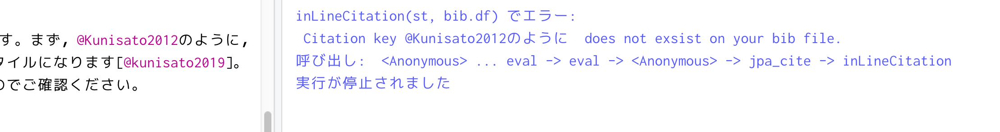
```


---
# コンパイルでエラーが出なくても・・・

+ エラーがなくてもリストをチェックしましょう
  + 姓名の区切り忘れがあると，NA(欠損値を表すRのコード)が入った変なレコードが出てきたりします。
  + yomiを入れるのを忘れると，ソートがJPA準拠ではなくなります。

---

# Enjoy!

+ jpaRmdの引用部分は完璧を目指していますが，実際に使い始めると様々な個別ケースが出てくるでしょう。
+ 手弁当で作っている関数ですが，エラーや要望があれば速やかに対応しますので，是非ご一報を。
  + 連絡先は[jpaRmdのGithubのIssue](https://github.com/ykunisato/jpaRmd/issues)から。
  + あるいは個別にご連絡いただいても構いません。[メール](mailto:kosugi@psy.senshu-u.ac.jp)をどうぞ。

```{r , echo=FALSE, fig.height=2.7, message=FALSE, warning=FALSE, dev='svglite', out.width='100%'}

```

